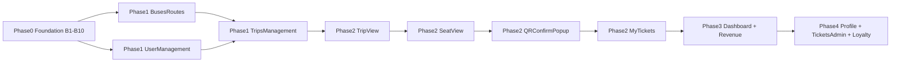
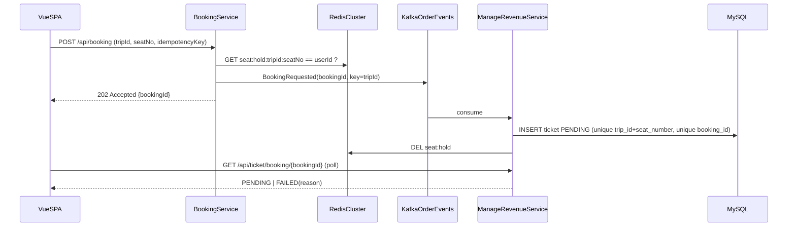

# Kế hoạch xây dựng tính năng theo màn hình (FE ↔ BE)

> Mỗi task: `/spec-review <ID>` → đọc `.claude/docs/review/<ID>-<slug>.md` → tick `spec`
> trong ledger → `/plan-task <ID>` (`.claude/skills/plan-task/SKILL.md`, bị chặn nếu chưa tick `spec`).
> Tiến độ theo dõi ở `.claude/ledger/screen-feature-plan.md`.

Nguồn bằng chứng: `booking_ticket_vue/src/{pages,services,stores,constants}`,
controller/service/entity trong `ticket-system/`, và 17 design doc ở
`.claude/docs/design/`. Mỗi khi ghi "BE có" nghĩa là đã thấy controller mapping
trong code, **chưa** có nghĩa là contract response khớp với FE.

Giả định: giữ path số ít (`/api/bus`, `/api/route`, `/api/trip`, `/api/ticket`,
`/api/user`) như BE hiện tại và như 17 design doc đã viết — FE đổi constants theo
BE, không đổi ngược.

---

## 0. Blocker xuyên suốt — phải xử lý trước mọi màn hình

| # | Vấn đề | Bằng chứng | Ảnh hưởng | Cách xử lý |
|---|---|---|---|---|
| B1 | **FE gọi sai base URL** | `api_endpoint.js`: fallback `8002` (system), `8001` (booking). BE chạy `8081`/`8082`. Kong proxy ở `8000`, còn `8001` là **Kong Admin API** | Không màn hình nào gọi được BE nếu `.env` không override; fallback booking đang trỏ vào Admin API của Kong | Cả 2 client trỏ `http://localhost:8000/api` (đi qua Kong). Kiểm tra `.env` của FE (chưa đọc vì bị chặn đọc `.env`) |
| B2 | **Path lệch số nhiều / số ít** | FE `/buses`, `/routes`, `/trips`, `/tickets`, `/users`, `/loyalty-points`, `/base-salary`. BE `/api/bus`, `/api/route`, `/api/trip`, `/api/ticket`, `/api/loyalty_point`, `/api/base_salary` | Mọi service admin + user trả 404 | Sửa `API_ENDPOINTS` theo BE, **chỉ cho endpoint BE đã có**. Endpoint BE chưa có giữ nguyên, đánh dấu `// BE: missing` |
| B3 | **Booking không tạo vé** | `BookingController` → `BookingProducer` → Kafka `order-events` → `RevenueConsumer.consumeBooking` chỉ `System.out.println` | Luồng đặt vé end-to-end không có kết quả | Xem mục 2.2 (thiết kế booking) |
| B4 | **Check sức chứa sai** | `countTicketsByBusId` đếm vé theo **bus trên mọi chuyến**, so sánh `==` thay vì `>=`, không trừ vé `CANCELLED`; không có unique `(trip_id, seat_number)` | Sau vài chuyến, xe báo hết chỗ vĩnh viễn; 2 người đặt trùng ghế | Đếm theo `trip_id`, `>=`, loại `CANCELLED`, thêm unique constraint |
| B5 | **Khách chỉ đặt được 1 vé cả đời** | `TicketService.createTicket`: `if customer.userStatus == BOOKED → throw` | Khách thứ 2 lần mua bị chặn | `(TODO/needs confirmation)` — đây là rule nghiệp vụ hay bug? Đề xuất bỏ check |
| B6 | **`UserController` rỗng** | `UserController.java` là class trống | User management, profile, chọn tài xế khi tạo chuyến đều bị chặn | Mục 1.2 |
| B7 | **Code chết + Feign trỏ path không tồn tại** | `booking_ticket/.../TicketService` không được ai gọi; `RevenueClient` gọi `/users/{id}`, `/loyalty/...`, `/trips/{id}` trên 8082 — không controller nào map các path đó | Gây hiểu nhầm khi đọc code | Xoá `TicketService` + `RevenueClient` của `booking_ticket` khi làm B3 |
| B8 | **Endpoint public nguy hiểm** | `SecurityConfig` permitAll `/api/ticket/summary/excel` (xuất doanh thu) và `/api/ticket/confirm` (nhận `price`, `customerId`, `seatNumber` qua query param). **Lưu ý có 2 lớp xác thực độc lập:** (1) Spring Security — `SecurityConfig` (`permitAll`) + `JwtAuthFilter` (danh sách bypass theo path); (2) `AuthInterceptor` (đăng ký `/**` ở `WebConfig`) đọc `@PublicApi`/`@RoleRequired` trên từng method. Endpoint "public" thật chỉ khi được mở ở **cả 2 lớp**. Excel: lớp (1) mở nhưng lớp (2) vẫn đòi JWT → thực tế không ẩn danh được, nhưng **mọi role đã đăng nhập** (kể cả CUSTOMER) tải được. Confirm/email: có `@PublicApi` nên mở ở cả 2 lớp | Mọi user đã đăng nhập tải được báo cáo doanh thu; ai cũng gọi được confirm vé với giá tự chọn | Excel → `@RoleRequired(ADMIN)` và bỏ khỏi `permitAll` + bypass của `JwtAuthFilter` (0.4, đã làm). Confirm → token ký (mục 2.3) |
| B11 | **Tự đăng ký làm ADMIN được** | `AuthService.java:33`: `role = user.getRole() == null ? CUSTOMER : user.getRole()` — lấy role từ body của `/api/auth/register` (public) | Bất kỳ ai cũng tạo được tài khoản ADMIN | Register public luôn gán `CUSTOMER`, bỏ qua `role` trong request |
| B12 | **Không phân quyền theo role ở controller quản trị** | `@RoleRequired` = 0 lần trong `BusController`, `TripController`, `TicketController`, `RevenueController` (chỉ `AdminDashboardController` có) | CUSTOMER đã đăng nhập tạo/sửa được xe, chuyến, xem doanh thu | Gắn `@RoleRequired(ADMIN)` cho mọi mutation + báo cáo |
| B9 | **Response trả entity / Map** | `Page<Buses>`, `Ticket` (field `trip`, `customer` `@JsonIgnore`), `ResponseEntity<?>` ở Revenue | FE phải đoán shape; đổi entity là vỡ FE | Tạo response DTO dần theo từng màn hình, không làm big-bang |
| B10 | **Không có migration** | `manage-revenue`: `ddl-auto=${JPA_DDL_AUTO:update}`; `booking_ticket`: `validate`; không có Flyway | Thêm unique constraint (B4) chỉ bằng `update` là không đáng tin — Hibernate không thêm constraint lên bảng đã có dữ liệu trùng | Thêm Flyway ở `manage-revenue-ticket` (V1 = baseline schema hiện tại) trước khi đổi schema |
| B14 | **Schema DB lệch entity, V1 chép theo DB** (phát hiện ở 0.3) | `tickets.status_ticket` trên DB local có `DEFAULT 'NOT_BOOKED'` nhưng `Ticket.java` không khai báo default. 3 FK không đặt tên (`base_salaries.user_id`, `loyalty_points.customer_id`, `audit_logs.user_id`) và unique `profiles.user_id`: DB Hibernate tạo có tên băm, V1 đặt `fk_base_salaries_user`, `fk_loyalty_points_customer`, `fk_audit_logs_user`, `uk_profiles_user_id`. Thứ tự giá trị ENUM trên DB là chữ cái, khác thứ tự khai báo Java | DB đã baseline (prod) và DB tạo mới từ V1 có tên constraint khác nhau. Migration sau mà `DROP FOREIGN KEY <tên>` sẽ đúng ở chỗ này, sai ở chỗ kia | Migration sau tra tên từ `information_schema`, không hardcode 4 constraint này. Đặt tên FK/unique tường minh trong entity ở một task sau. `(TODO/needs confirmation)` chạy query `information_schema.columns` trên prod để chắc prod khớp V1 trước khi bật baseline |
| B15 | **Tài liệu trạng thái vé lệch code** (phát hiện ở 0.3) | `CLAUDE.md` ghi Ticket `NOT_BOOKED → BOOKED → PAID \| CANCELLED`. Code (`TicketStatus`) là `NOT_BOOKED, PENDING, CANCELLED, SUCCESS` | Thiết kế 2.2/2.4 dựa trên tên trạng thái sai | Gộp vào 1.1 cùng lệch Bus status (`ACTIVE/INACTIVE/PENDING` so với `AVAILABLE/IN_USE/MAINTENANCE`) |
| B16 | **`PasswordEncoder` khởi tạo ad hoc, không phải bean** (phát hiện ở 0.5) | `AuthService.java:19`: `private final BCryptPasswordEncoder passwordEncoder = new BCryptPasswordEncoder();` — không inject bean. Quy tắc `.claude/references/backend/rules/security.md` yêu cầu "hashed with a configured `PasswordEncoder` bean" và "Do not instantiate password encoders ad hoc in services" | Không đổi được strength/thuật toán tập trung; mỗi service tự tạo encoder riêng thì dễ lệch cấu hình. Chưa gây lỗi vì hiện chỉ có 1 nơi dùng | Khai báo `@Bean PasswordEncoder` (BCrypt, strength cấu hình được) trong `common-library` `SecurityConfig`, inject vào `AuthService`. Không gộp vào 0.5 vì phải thêm bean định nghĩa mới — nằm ngoài fix scope đã duyệt |
| B17 | **CORS cho mọi origin kèm credentials** (phát hiện ở 0.4, lead-review L4) | `SecurityConfig.java:41` `setAllowedOriginPatterns(List.of("*"))` + `:44` `setAllowCredentials(true)`; `TicketController.java` `@CrossOrigin(origins = "*")` ở mức class | Origin bất kỳ được phản chiếu lại kèm credentials. Chưa khai thác được với Bearer token hiện tại (token không tự gửi cross-origin), nhưng sẽ thành lỗ hổng ngay khi có auth bằng cookie | Liệt kê origin cho phép qua biến môi trường (FE `:5173`, Kong `:8000`, domain prod); bỏ `@CrossOrigin(origins = "*")` ở controller để CORS chỉ cấu hình 1 chỗ |
| B18 | **Lỗi trả về lộ thông tin nội bộ, không log, 3 kiểu body 401** (phát hiện ở 0.4, review độc lập) | `GlobalExceptionHandler.java:37-53` trả nguyên `ex.getMessage()` cho mọi exception chưa bắt và không log server-side — kể cả trên `/api/ticket/confirm`, `/api/ticket/email` public. 401 có 3 dạng body: `CustomAuthEntryPoint` (`{status,message}`), `JwtAuthFilter` và `AuthInterceptor` (`BaseResponseDto.error`) | Người gọi ẩn danh đọc được message lỗi nội bộ; lỗi 500 không để lại dấu vết cho on-call; FE không parse được lỗi xác thực theo 1 kiểu | `handleAllExceptions`/`handleRuntimeException`: log `error` kèm stack, trả message chung. Gom 401/403 về 1 dạng body (`BaseResponseDto.error`) |
| B19 | **Vệ sinh JWT/auth** (phát hiện ở 0.4, review độc lập) | `JwtAuthFilter.java:54` còn bypass `/api/redis-test` nhưng controller thật map `/api/test-redis` (`RedisTestController.java:14`) → rule chết. `JwtUtil.java:30-51`: access và refresh token cùng hạn 24h, cùng claim (comment ghi access 15 phút) | Rule bypass mồ côi sẽ tự mở lỗ nếu sau này ai thêm endpoint trùng path; token access bị lộ dùng được cả ngày, refresh không khác access | Xoá bypass `/api/redis-test` (hoặc bảo vệ `RedisTestController` và bỏ nó khỏi prod). Tách hạn access (ngắn) / refresh (dài), thêm claim `type` và chặn refresh token ở API thường |

---

## 1. Thứ tự xây dựng (theo phụ thuộc dữ liệu)

Lý do admin trước khách: khách không tìm được chuyến nếu chưa có xe, tuyến,
tài xế, chuyến trong DB. Làm admin trước = có công cụ tạo dữ liệu test thật
thay vì seed SQL tay.

---

## Phase 0 — Foundation

| ID | Task | Tầng | Size | DoD |
|---|---|---|---|---|
| 0.1 | Dùng 1 base URL duy nhất `API_BASE_URL_SYSTEM` (`VITE_KONG_API_URL`) → Kong `:8000/api`; bỏ `bookingClient`/`API_BASE_URL_BOOKING` | FE | S | `npm run dev` gọi `/api/auth/login` qua Kong thành công |
| 0.2 | Đồng bộ `API_ENDPOINTS` với path BE đã có (B2) | FE | S | Mỗi entry có comment trỏ `Controller.java:line` hoặc `// BE: missing` |
| 0.3 | Thêm Flyway + baseline V1 | BE | M | `mvn -f manage-revenue-ticket/pom.xml spring-boot:run` với `ddl-auto=validate` khởi động được |
| 0.4 | Khoá endpoint public (B8) | BE | S | `/api/ticket/summary/excel`: không token → 401 **do Spring Security trả** (không phải interceptor); token CUSTOMER/DRIVER/COLLECTOR → **403**; token ADMIN → 200. Kiểm bằng `TicketExcelSecurityChainTest` (chạy qua reactor: `mvn -f ticket-system/pom.xml -pl manage-revenue-ticket -am test`) |
| 0.5 | Chặn tự đăng ký ADMIN (B11) + gắn `@RoleRequired` (B12) | BE | S | Register với `role=ADMIN` → tài khoản vẫn là CUSTOMER; CUSTOMER gọi `POST /api/bus` → 403 |
| 0.6 | `GET /api/auth/me` | BE | S | Trả `id, email, role, fullName` từ JWT; `authStore.fetchMe` dùng được |
| 0.7 | Quy ước response list: `PageResponse<T>{content, page, size, totalElements, totalPages}` trong `common-library` | BE | S | Dùng cho mọi list mới ở Phase 1–4 |
| 0.8 | Sửa check sức chứa (B4): đếm theo `trip_id`, `>=`, loại `CANCELLED` + migration unique `(trip_id, seat_number)` | BE | M | Test: chuyến 2 của cùng xe vẫn đặt được; insert trùng ghế → `DataIntegrityViolationException` |

`/api/auth/logout` và `/refresh`: FE đã gọi nhưng BE chưa có. JWT stateless nên
logout có thể chỉ xoá token phía FE; refresh để Phase 4. Ghi rõ trong
`authService.js`, đừng để FE gọi 404 im lặng.

---

## Phase 1 — Admin: dữ liệu gốc

### 1.1 BusesRoutes (`pages/admin/BusesRoutes.vue`)
Design: `admin-buses-routes.md`, `admin-create-bus-modal.md`, `admin-create-route-modal.md`, `admin-delete-confirmation.md`

| Tính năng | FE hiện tại | BE hiện tại | Cần làm BE | Cần làm FE |
|---|---|---|---|---|
| List xe (phân trang) | Gọi `busService.getAll()`, fallback `BUSES_ROUTES_FALLBACK_BUSES` | `GET /api/bus?page&size` → `Page<Buses>` (entity) | Response DTO `BusResponse`; filter `status` | Đổi path, bỏ fallback khi API trả OK, map `PageResponse` |
| Tạo / sửa xe | Service có | `POST`, `PUT /api/bus/{id}` — trả `null` data, code 201 ở cả PUT | Validate `@Valid` (`plateNumber` unique, `capacity > 0`); trả object vừa tạo | Wire modal submit → store action → toast |
| Xoá xe | Service có | **Chưa có** | `DELETE /api/bus/{id}` — chặn nếu xe có trip `SCHEDULED/ONGOING`; soft-delete qua `status` | Dialog xác nhận dùng pattern chung |
| List tuyến | Gọi `routeService.getAll()`, fallback | **Chưa có GET** | `GET /api/route?page&size&status` + `GET /api/route/{id}` | Như list xe |
| Tạo / sửa / xoá tuyến | Service có | `POST`, `PUT` có; DELETE chưa | `DELETE /api/route/{id}` — chặn nếu còn trip tương lai; bỏ `System.out.println` | Wire modal |

Chưa có store cho bus/route — page gọi service trực tiếp. Theo quy ước repo
(page → store → service), thêm `stores/busRoute.js`.

### 1.2 UserManagement (`pages/admin/UserManagement.vue`)
Design: `admin-user-management.md`

| Tính năng | FE hiện tại | BE hiện tại | Cần làm BE | Cần làm FE |
|---|---|---|---|---|
| List user theo role, phân trang | `userStore.fetchAll`, fallback `USER_MANAGEMENT_FALLBACK_USERS` | **Không có** (`UserController` rỗng) | `GET /api/user?role&page&size&keyword` | Đổi path `/users` → `/user` |
| Chi tiết / sửa | Service có | Không có | `GET`, `PUT /api/user/{id}` (sửa `role`, profile) | Modal sửa |
| Khoá / mở khoá | Chưa có | Không có | `PUT /api/user/{id}/status` (`isActive`) | Toggle trên row |
| Xoá | `userStore.deleteUser` | Không có | **Soft-delete** (`isActive=false`) — user có FK từ `tickets` và `trips.driver_id` | Dùng dialog xác nhận |
| Tạo user | Service có | `POST /api/auth/register` | Tách `POST /api/user` (ADMIN tạo được DRIVER/COLLECTOR; register public chỉ cho CUSTOMER) | Form tạo |
| Bulk action | UI có | Không có | `(TODO/needs confirmation)` — hoãn | Ẩn nút tới khi chốt |

Toàn bộ endpoint `@RoleRequired(ADMIN)`. Sửa B11 trước, nếu không thì việc
phân quyền ở màn hình này là vô nghĩa.

### 1.3 TripsManagement (`pages/admin/TripsManagement.vue`)
Design: `admin-trips-management.md`, `admin-create-trip-modal.md`, `admin-schedule-trip-review.md`

| Tính năng | FE hiện tại | BE hiện tại | Cần làm BE | Cần làm FE |
|---|---|---|---|---|
| List chuyến + filter status/ngày/tuyến | `tripService.getAll()` (gọi thẳng service), fallback `TRIPS_MANAGEMENT_FALLBACK_TRIPS` | `GET /api/trip/scheduled?page&size` — chỉ SCHEDULED, trả `Map` | Đổi thành `GET /api/trip?status&routeId&from&to&page&size`, trả `TripResponse` | Dùng `tripStore.fetchAll`, filter bar |
| Wizard tạo chuyến 4 bước | Modal UI | `POST /api/trip` | Dropdown cần: `GET /api/route` (1.1), `GET /api/user?role=DRIVER` (1.2), `GET /api/bus?status=AVAILABLE` | Bước 1–3 load option, bước 4 submit |
| Check trùng lịch | — | Không có | Khi tạo/sửa: xe và tài xế không được có trip chồng thời gian (`departure < other.arrival AND arrival > other.departure`) | Hiện lỗi 409 ở bước Review |
| Sửa / huỷ chuyến | Service có | `PUT /api/trip/{id}` | `PATCH /api/trip/{id}/status` với state machine `SCHEDULED→ONGOING→COMPLETED`, `SCHEDULED→CANCELLED`; huỷ chuyến → huỷ vé liên quan | Nút action theo status |
| Xoá chuyến | Service có | Không có | Chỉ cho xoá khi chưa có vé; còn lại bắt buộc dùng CANCELLED | — |
| Doanh thu 1 chuyến | — | `GET /api/trip/{id}/revenue` | Không cần | Hiện trong drawer chi tiết |

---

## Phase 2 — Khách hàng: luồng đặt vé

### 2.1 TripView (`pages/user/TripView.vue`)
Design: `trip-search-results.md`

| Tính năng | FE hiện tại | BE hiện tại | Cần làm BE | Cần làm FE |
|---|---|---|---|---|
| Autocomplete điểm đi/đến | Static | Không có | `GET /api/route/locations` (distinct `startPoint`/`endPoint` của route ACTIVE), cache Redis TTL 1h | Combobox |
| Tìm chuyến | 7 TODO, card static `TRIP_VIEW_FALLBACK_TRIPS` | Không có | `GET /api/trip/search?from&to&date&page&size` → chỉ `SCHEDULED`, `departureTime > now`; trả `availableSeats` | `tripStore.search` → render list |
| Sort (giờ, giá) | UI có, chưa wire | — | Param `sort=departureTime,asc` (Spring `Pageable`) | Đổi sort → re-fetch |

`availableSeats` = `bus.capacity − count(tickets where trip_id=? and status != CANCELLED)`.
Tính trong 1 query `GROUP BY trip_id`, không N+1.

### 2.2 SeatView (`pages/user/SeatView.vue`) — màn hình phức tạp nhất
Design: `seat-selection-checkout.md`

| Tính năng | FE hiện tại | BE hiện tại | Cần làm BE | Cần làm FE |
|---|---|---|---|---|
| Sơ đồ ghế | Static `SEAT_VIEW_BOOKED_SEAT_NUMBERS = [1,4,7,...]` | Không có | `GET /api/trip/{id}/seats` → `{capacity, booked:[], held:[]}` | `seatStore.fetchByTrip`; state trống / đang chọn / đã bán / đang giữ |
| Giữ ghế khi chọn | — | Không có | `POST /api/trip/{id}/seats/{no}/hold` — Redis `SET seat:hold:{tripId}:{no} {userId} NX EX 600` | Gọi khi click ghế, hiện countdown 10 phút |
| Nhập thông tin hành khách | Form UI | — | — | Validate theo design doc |
| Đặt vé | `bookingStore.bookTicket` → `ticketService.book` → `POST /tickets` (sai path) | `POST /api/booking` → Kafka → consumer không làm gì | Xem thiết kế bên dưới | Nhận `bookingId`, chuyển sang màn thanh toán |

**Thiết kế booking (thay cho B3):**

- `customerId` lấy từ JWT, **không** nhận từ body — `TicketRequestDto` hiện cho
  client gửi `customerId`, `sellerId`, `price`, `status`, `issuedAt`. Giá lấy từ
  trip/route phía server.
- Partition key = `tripId` → mọi booking cùng chuyến đi vào 1 partition, xử lý
  tuần tự; unique constraint vẫn là lớp chặn cuối.
- Consumer idempotent qua unique `booking_id`: nhận trùng message → bắt
  `DataIntegrityViolationException` → bỏ qua.
- Consumer lỗi → retry 3 lần rồi DLT `order-events.DLT`; FE poll thấy `FAILED`.

### 2.3 QRConfirmPopup (`pages/user/QRConfirmPopup.vue`)
Design: `payment-booking-confirmation.md`

| Tính năng | FE hiện tại | BE hiện tại | Cần làm BE | Cần làm FE |
|---|---|---|---|---|
| Hiện tóm tắt vé | — | Không có `GET /api/ticket/{id}` | `GET /api/ticket/{id}` (chỉ chủ vé hoặc ADMIN) | Summary card |
| QR thanh toán | `paymentService.getQRCode` → `/payments/...` | Không có module payment | `(TODO/needs confirmation)`: cổng thanh toán nào? Tạm thời: QR tĩnh + admin xác nhận tay | Hiện QR |
| Xác nhận qua email | — | `EmailConfirmTicketConsumer` gửi link; `/api/ticket/email`, `/api/ticket/confirm` là stub `println` | Link email mang **token ký** (HMAC `ticketId+exp`), endpoint đọc token → `PENDING→SUCCESS`, idempotent | Trang kết quả |
| Hết hạn giữ vé | — | Không có | Job định kỳ: vé `PENDING` quá 15 phút → `CANCELLED` | Hiện trạng thái hết hạn |

### 2.4 MyTickets (`pages/user/MyTickets.vue`)
Design: `my-tickets.md`

| Tính năng | FE hiện tại | BE hiện tại | Cần làm BE | Cần làm FE |
|---|---|---|---|---|
| List vé của tôi theo tab (sắp đi / đã đi / đã huỷ) | `fetchMyTickets`, **fallback `MOCK_TICKETS` kể cả khi API lỗi** | Không có | `GET /api/ticket/me?tab&page&size` — `customerId` từ JWT | Bỏ fallback mock khi lỗi, hiện error state |
| Huỷ vé | `ticketService.cancel` → `PATCH /tickets/{id}/cancel` | Không có | `PATCH /api/ticket/{id}/cancel` — chỉ khi trip `SCHEDULED` và còn > N giờ trước giờ đi | Nút huỷ + dialog |
| Lý do hoàn tiền | UI có | Không có field | `(TODO/needs confirmation)` — hoãn | — |

---

## Phase 3 — Báo cáo

### 3.1 DashboardView — gần sẵn sàng
BE `GET /api/admin/dashboard`, `GET /api/admin/revenue?period` đã có với DTO rõ
ràng, có `@RoleRequired(ADMIN)`. FE đã gọi qua `adminStore`. Việc còn lại: sửa
base URL (B1), thay KPI tĩnh `DASHBOARD_KPIS` bằng dữ liệu API, test với dữ liệu
thật sinh từ Phase 1–2.

### 3.2 RevenueReports
BE có 4 endpoint `/api/revenue/{report,by-route,by-date,top-customers}` — path FE
**đã khớp**. Việc còn lại:
- `ResponseEntity<?>` / `Map` → DTO riêng (`RevenueSummaryResponse`, …).
- `top-customers` trả key `staff` — tên sai nghĩa, đổi hoặc đổi tên endpoint.
- Nút xuất Excel → `GET /api/ticket/summary/excel` (sau khi khoá B8), dùng skill
  `frontend-integrate-download-api`.

---

## Phase 4 — Phụ

| ID | Màn hình | Hiện trạng | Việc |
|---|---|---|---|
| 4.1 | ProfileView | Stub 12 dòng, không có design doc | Chạy `/clear-spec` trước; BE `GET/PUT /api/user/me` (dùng entity `Profile` đã có) |
| 4.2 | TicketsAdmin | Stub 14 dòng, không có design doc | `/clear-spec`; BE `GET /api/ticket?tripId&status&page` + admin đổi status |
| 4.3 | Loyalty | FE service có, path lệch (`/loyalty-points` vs `/api/loyalty_point`); BE chỉ có POST/PUT, không có GET | Chốt rule tích điểm (hiện bị comment out trong `TicketService.createTicket`) trước khi làm |
| 4.4 | Salary | BE có `/api/salary`, `/api/base_salary`; FE chưa có page | Không có màn hình → để sau |
| 4.5 | RegisterPage | Chạy được; thiếu `fullName`, `phone` theo design | Thêm field vào `UserRequestDto` + lưu `Profile` |

---

## 2. Trade-off

**(a) Tại sao async (Kafka + Redis hold) cho booking thay vì `POST /api/ticket` đồng bộ.**
Đồng bộ đơn giản hơn nhiều: 1 transaction, unique constraint, trả kết quả ngay —
và `POST /api/ticket` đã tồn tại. Chọn async chỉ vì kiến trúc repo đã tách
`booking_ticket` + Kafka với mục tiêu học event-driven; Redis hold bù lại nhược
điểm lớn nhất của async (user không biết ghế còn hay không cho tới khi consumer
chạy). Nếu mục tiêu chuyển sang "chạy được sớm nhất", làm đồng bộ trước rồi tách
sau — unique constraint và seat map API vẫn dùng lại được y nguyên.

**(b) Edge case chính.**
- Redis node chết giữa lúc giữ ghế → hold mất, 2 user cùng gửi booking →
  unique `(trip_id, seat_number)` chặn người thứ 2, poll thấy `FAILED`.
- Kafka chậm / consumer lag → FE poll timeout: FE poll tối đa 30s rồi hiện
  "đang xử lý, kiểm tra ở Vé của tôi", không hiện lỗi giả.
- Hold hết hạn trong lúc user nhập form → `POST /api/booking` trả 409, FE quay
  lại sơ đồ ghế.
- Admin huỷ chuyến khi có vé `PENDING` trong Kafka → consumer phải check trip
  status trước khi insert.

**(c) Debug / trace.**
- Kong đã gắn `X-Request-ID` (plugin `correlation-id`) → đưa vào MDC ở cả 2
  service và vào Kafka header, log `bookingId` + `requestId` ở mọi bước.
- Metric: consumer lag `order-events` theo group `booking-group`; số booking
  `FAILED` theo lý do (`SEAT_TAKEN`, `HOLD_EXPIRED`, `TRIP_NOT_SCHEDULED`); số
  message vào DLT.
- Thay toàn bộ `System.out.println` trong `RevenueConsumer`, `TicketController`,
  `RouteController` bằng SLF4J.

---

## 3. Mở — cần chốt trước khi code phần liên quan

| Câu hỏi | Chặn |
|---|---|
| Rule "khách đã BOOKED không được đặt tiếp" là nghiệp vụ hay bug? (B5) | 2.2 |
| Thanh toán thật (VNPay/MoMo) hay xác nhận tay / qua email? | 2.3 |
| Huỷ vé trước giờ đi bao lâu? Có hoàn tiền không? | 2.4 |
| Bulk action ở UserManagement gồm những gì? | 1.2 |
| Loyalty: bao nhiêu vé = 1 điểm, dùng điểm đổi gì? | Phase 4 |
