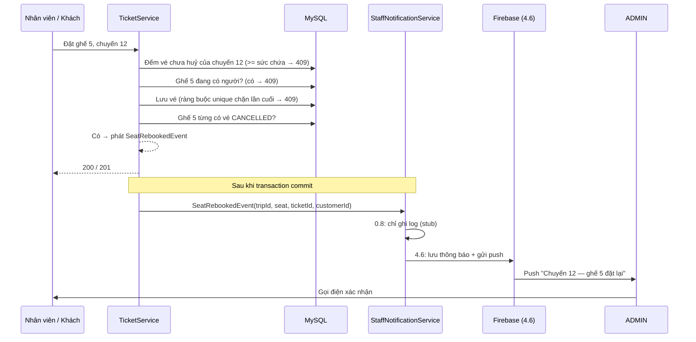

# Nghiệp vụ: giữ chỗ theo chuyến, trùng ghế, và báo ADMIN khi ghế đã huỷ được đặt lại

- Task liên quan: **0.8** (sửa check sức chứa + unique ghế), **4.6** (thông báo Firebase cho ADMIN).
- Spec review: `.claude/docs/review/0.8-capacity-unique-seat.md` (D1–D4, N1).
- Ngày chốt: 2026-09-24.

---

## 1. Vấn đề hiện tại (trước 0.8)

| # | Lỗi | Hậu quả ngoài đời |
|---|---|---|
| 1 | Đếm vé theo **xe trên mọi chuyến**, không theo chuyến | Xe 40 chỗ chạy vài chuyến là báo "hết vé" vĩnh viễn |
| 2 | Vé đã huỷ vẫn được đếm | Khách huỷ nhưng ghế không được trả lại |
| 3 | So sánh `==` thay vì `>=` | Vượt sức chứa 1 lần là không bao giờ chặn nữa |
| 4 | Không kiểm tra ghế đã có người, DB không có ràng buộc | 2 khách cầm vé cùng 1 ghế |

---

## 2. Quy tắc sau khi chốt

| Mã | Quy tắc | Kết quả với người dùng |
|---|---|---|
| D1 | Mỗi chuyến, mỗi ghế chỉ có **1 vé chưa huỷ**. Vé `CANCELLED` **trả lại ghế** | Ghế huỷ bán lại được; lịch sử vé huỷ vẫn giữ |
| D2 | Hết chỗ hoặc ghế đã có người → **409 Conflict** | FE hiện "Ghế đã có người, chọn ghế khác" |
| D3 | Khi tạo vé, số ghế **bắt buộc** và trong khoảng `1..sức chứa` → sai thì **400** | Không đặt được ghế 0 hay ghế 41 trên xe 40 chỗ |
| D4 | Dữ liệu trùng ghế có sẵn → **admin xử lý tay** trước khi triển khai | Khách được liên hệ, không bị huỷ vé âm thầm |
| N1 | Đặt (hoặc đổi sang) một ghế **từng có vé bị huỷ** trên cùng chuyến → **báo ADMIN** để admin **gọi cho người vừa đặt** | Admin xác nhận với khách mới, tránh nhầm lẫn khi khách cũ còn tưởng mình có ghế |

N1 áp dụng cho **mọi kiểu huỷ**: khách tự huỷ, admin huỷ, huỷ khi dọn dữ liệu trùng (D4).

---

## 3. Mô phỏng: chuyến số 12, xe 40 chỗ

### Giai đoạn 1: trước 0.8 (dữ liệu đã bị trùng)

| Giờ | Việc xảy ra | Hệ thống |
|---|---|---|
| 08:00 | Nhân viên đặt cho **An** ghế 5 | Lưu vé #101 `PENDING` |
| 08:05 | Nhân viên khác đặt cho **Bình** ghế 5 | Không kiểm tra, vẫn lưu vé #102 `PENDING` |

| id | chuyến | ghế | trạng thái | khách |
|---|---|---|---|---|
| 101 | 12 | 5 | PENDING | An |
| 102 | 12 | 5 | PENDING | Bình |

### Giai đoạn 2: chuẩn bị triển khai 0.8 (D4 — xử lý tay)

1. Admin chạy query kiểm tra trùng:
   ```sql
   SELECT trip_id, seat_number, COUNT(*)
   FROM tickets
   WHERE status_ticket <> 'CANCELLED' AND seat_number IS NOT NULL
   GROUP BY trip_id, seat_number
   HAVING COUNT(*) > 1;
   ```
   Kết quả: `trip_id=12, seat_number=5, COUNT=2`.
2. Admin gọi Bình, thống nhất chuyển sang ghế 6 **hoặc** huỷ vé #102 và hoàn tiền.
   Giả sử Bình chọn huỷ, vé #102 thành `CANCELLED`.
3. Chạy lại query → rỗng → triển khai 0.8, migration V2 thêm ràng buộc thành công.

> Nếu bỏ qua bước 1–2, V2 bị MySQL từ chối và service `manage-revenue-ticket` không khởi động được.

### Giai đoạn 3: vận hành sau 0.8

| Giờ | Việc xảy ra | Hệ thống | Quy tắc |
|---|---|---|---|
| 09:00 | **Chi** đặt ghế 5, chuyến 12 (An đang giữ) | Từ chối **409** | D1, D2 |
| 09:10 | Chi đặt ghế 5, **chuyến 13** (cùng xe) | Cho đặt, vì đếm theo chuyến | D1 |
| 09:20 | **An huỷ** vé #101 | #101 thành `CANCELLED`, ghế 5 chuyến 12 trống | D1 |
| 09:25 | **Dũng** đặt ghế 5, chuyến 12 | Lưu vé #110; ghế 5 **từng có vé huỷ** (#101, #102) nên phát sự kiện **"ghế đặt lại"** | N1 |
| 09:25 | (sau khi lưu xong) | ADMIN nhận thông báo: "Chuyến 12 — ghế 5 vừa được đặt lại (vé #110). Gọi xác nhận với khách." | N1 |
| 09:30 | Admin mở thông báo, thấy tên + SĐT của Dũng, **gọi cho Dũng** xác nhận, bấm "Đã gọi" | Thông báo chuyển `CALLED` | N1 (4.6) |
| 09:40 | Ai đó đặt ghế 41 | Từ chối **400** | D3 |
| 09:45 | Hai người bấm đặt ghế 7 cùng lúc | Người đến trước được lưu; người sau bị DB chặn → **409** | D1, D2 |

Không phát thông báo khi:
- Ghế chưa từng có vé huỷ (ví dụ Chi đặt ghế 5 chuyến 13 lúc 09:10).
- Lưu vé thất bại (409/400), vì thông báo chỉ gửi **sau khi vé đã lưu thành công**.
- Sửa vé nhưng giữ nguyên ghế.

---

## 4. Luồng kỹ thuật



---

## 5. Phân chia công việc

| Phần | Task | Nội dung |
|---|---|---|
| Đếm theo chuyến, `>=`, loại vé huỷ | 0.8 | `TicketRepository`, `TicketService` |
| Ràng buộc DB 1 ghế / 1 vé chưa huỷ | 0.8 | Migration `V2__tickets_unique_active_seat.sql` |
| Lỗi 409 / 400 | 0.8 | `ConflictException` trong `common-library` |
| Phát sự kiện "ghế đặt lại" + service thông báo **rỗng** (chỉ log, có comment) | 0.8 | `SeatRebookedEvent`, `StaffNotificationService` |
| Lưu thông báo, gửi Firebase, đăng ký token thiết bị | 4.6 | Bảng `staff_notifications`, `device_tokens`; Firebase Admin SDK |
| API danh sách thông báo, đánh dấu đã gọi | 4.6 | `GET /api/notification`, `PATCH /api/notification/{id}/called`, `POST /api/notification/device-token` (ADMIN) |
| Chuông + danh sách thông báo ở màn admin | 4.6 | Admin header, drawer thông báo |
| Endpoint huỷ vé (để luồng huỷ → đặt lại chạy từ UI) | 2.4 (khách), 4.2 (admin) | `PATCH /api/ticket/{id}/cancel` |

---

## 6. Câu hỏi còn mở (cho 4.6)

- Firebase project nào, ai cấp service account (tên biến môi trường dự kiến `FIREBASE_CREDENTIALS_PATH`)?
- Có cần lưu lịch sử thông báo không, hay chỉ push?
- ADMIN offline khi thông báo tới: chỉ cần xem lại trong danh sách, hay cần kênh khác (email)?
- Admin gọi xong có cần ghi kết quả cuộc gọi (khách xác nhận / huỷ) không?
