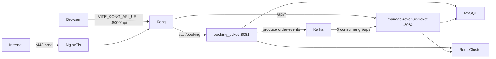

# Infrastructure — Context Index

Context cho Claude khi làm việc với hạ tầng System_bus. Mỗi thành phần có 1 file riêng; file này
là bản đồ tổng: topology, mạng, cổng, 2 chế độ chạy, và các **contract chéo file** (đổi 1 chỗ phải đổi
chỗ khác).

Nguồn sự thật (runbook cho người): `ticket-system/Infrastructure/README.md` + `README.md` từng thư mục.
Khi file này và compose/config thật lệch nhau → tin compose/config, rồi cập nhật file này.

| File | Thành phần | Nguồn chính |
|---|---|---|
| [mysql.md](mysql.md) | MySQL 8 — DB `quan-ly-ban-hang`, Flyway | `Infrastructure/mysql/` |
| [kafka.md](kafka.md) | Kafka 3 broker KRaft + Kafka UI, topic `order-events` | `Infrastructure/kafka/` |
| [redis-cluster.md](redis-cluster.md) | Redis Cluster 6 node (cache, session, giữ ghế) | `Infrastructure/redis-cluster/` |
| [kong.md](kong.md) | Kong 3.9 DB-less — API Gateway, điểm vào duy nhất của FE | `Infrastructure/kong/` |
| [app-services.md](app-services.md) | 2 Spring Boot service chạy container, Dockerfile | `Infrastructure/app/`, `<module>/Dockerfile` |
| [tls-nginx.md](tls-nginx.md) | NGINX TLS termination + certbot (chỉ prod) | `Infrastructure/tls/` |
| [production-cicd.md](production-cicd.md) | VM prod 6GB, RAM override, CI/CD GHCR, FE Vercel | `docker-compose.prod.override.yml`, `ci-cd.yml`, `DEPLOYMENT.md` |
| [k8s-sandbox.md](k8s-sandbox.md) | Bài tập k3s trên VM2 | `Infrastructure/k8s-sandbox/` |

Đường dẫn trong các file này tính từ root repo `System_bus/`; `Infrastructure/` = `ticket-system/Infrastructure/`.

## Topology

## Mạng Docker — container chỉ gọi được tên container khác khi cùng mạng

| Mạng | Ai tạo | Thành viên |
|---|---|---|
| `ticket-system-network` | tay, 1 lần: `docker network create ticket-system-network` | mysql, kong, app (2 service), tls |
| `kafka_kafka-net` | `kafka/docker-compose.yml` (tên thật = `<project kafka>_kafka-net`) | broker1-3, kafka-ui, app |
| `redis-cluster-net` 172.30.0.0/16 | `redis-cluster/docker-compose.yml` (tên cố định) | redis-1..6 (IP 172.30.0.11-16), app |

Container BE phải join **cả 3 mạng**. Kong chỉ cần `ticket-system-network`.

## Cổng trên host

| Cổng | Thành phần |
|---|---|
| 8000 | Kong proxy (FE gọi) |
| 127.0.0.1:8001 | Kong Admin API (không auth, chỉ loopback) |
| 8081 / 8082 | BE khi chạy IntelliJ (container BE **không** publish cổng) |
| 3306 | MySQL |
| 9092 / 9093 / 9094 | Kafka listener `PLAINTEXT_HOST` |
| 9000 | Kafka UI |
| 7001-7006 / 17001-17006 | Redis client / cluster bus |
| 80 / 443 | NGINX TLS (chỉ prod) |

## Hai chế độ chạy BE — chọn 1, KHÔNG chạy song song

| | Dev: BE trong IntelliJ | Container: BE bằng Docker |
|---|---|---|
| Lệnh Kong | `docker compose -f docker-compose.yml -f docker-compose.dev.yml up -d --force-recreate` | `docker compose up -d --force-recreate` |
| Kong config | `kong.dev.yml` → `host.docker.internal:8081/8082` | `kong.yml` → `booking-container:8081`, `manage-revenue-ticket:8082` |
| BE → MySQL | `localhost:3306` | `mysql-ticket-system:3306` |
| BE → Kafka | `localhost:9092-9094` | `broker1-3:29092` |
| BE → Redis | `172.30.0.x` → map sang `127.0.0.1:700x` | `redis-1..6`, dùng thẳng IP 172.30.x |

Chạy song song → 2 bản BE tranh chung Kafka consumer group và Redis session → lỗi khó đoán.

## Thứ tự khởi động (lần đầu)

`network create` → mysql → kafka → redis-cluster (+ `--cluster create` 1 lần) → kong → app (nếu chế độ
container) → tls (chỉ prod). Không compose nào có `depends_on` chéo (B27d) — thứ tự do người chạy giữ.

## Contract chéo file — đổi 1 bên phải đổi bên kia

| Giá trị | Xuất hiện ở |
|---|---|
| `container_name` `booking-container`, `manage-revenue-ticket` | `app/docker-compose.yml` ↔ `target` trong `kong/kong.yml` |
| `mysql-ticket-system` | `mysql/docker-compose.yml` ↔ `SPRING_DATASOURCE_URL` trong `app/docker-compose.yml` |
| `broker1-3:29092`, `localhost:9092-9094` | `kafka/docker-compose.yml` (LISTENERS/ADVERTISED) ↔ `app/docker-compose.yml` ↔ `application.properties` 2 service |
| IP `172.30.0.11-16`, subnet `172.30.0.0/16` | `redis-cluster/docker-compose.yml` (`ipv4_address` = `--cluster-announce-ip`) ↔ `application.properties` ↔ lệnh `--cluster create` (CLAUDE.md, README) |
| `kafka_kafka-net` | tên project thư mục `kafka/` ↔ `external name` trong `app/docker-compose.yml` |
| `kong.yml` ≡ `kong.dev.yml` trừ 2 dòng `target` | `kong/` |
| Kong `read/write_timeout` 60000ms | `kong.yml` ↔ `proxy_read/send_timeout 60s` trong `tls/nginx.conf` |
| Readiness `/actuator/health/readiness` = `readinessState,db,redis` | `kong.yml` healthchecks ↔ `management.endpoint.health.*` trong `application.properties` ↔ `permitAll` trong `common-library/.../SecurityConfig.java` |
| Tên service compose (`broker1`, `mysql`, `kong`, `redis-node-N`, `booking-service`, `manage-revenue-ticket`) | file gốc ↔ `docker-compose.prod.override.yml` |
| `DB_PASSWORD` (.env) | phải bằng `MYSQL_ROOT_PASSWORD` trong `mysql/docker-compose.yml` |

## Chẩn đoán nhanh: trình duyệt báo CORS

Gần như luôn là Kong trả 503 (không upstream nào khoẻ), không phải lỗi CORS thật — header CORS do BE trả.
Kiểm theo thứ tự: Kong đúng chế độ? → `curl 127.0.0.1:8001/upstreams/<name>/health` → readiness BE →
DB/Redis BE có tới được không → vừa recreate BE thì đợi 10-20s (DNS TTL Kong). Chi tiết: [kong.md](kong.md).

## Quy tắc khi Claude sửa hạ tầng

- Không đọc `.env` / `.env.*`, không in env, không dán secret. Tên biến: `.claude/references/backend/environment-variable-names.md`.
- Không sửa `Infrastructure/redis-cluster/data/**` (dữ liệu runtime).
- Không đổi container name, advertised listener, cluster-announce IP, tên mạng, tên volume nếu không cập nhật
  mọi chỗ trong bảng contract ở trên trong cùng 1 thay đổi.
- Sửa `kong.yml` → sửa `kong.dev.yml` tương ứng; kiểm bằng `kong config parse` (xem [kong.md](kong.md)).
- Kiểm compose bằng `docker compose -f ... config --quiet` trước khi báo xong.
- Lỗi/tồn đọng hạ tầng được theo dõi trong `.claude/docs/plan/screen-feature-plan.md` mục B25 (đã sửa), B27, B28, B29.

## Lệch tài liệu đã biết (phát hiện 2026-09-28 khi viết bộ context này)

| Chỗ | Lệch |
|---|---|
| `CLAUDE.md` (root) mục Infrastructure Setup | còn `docker network create redis-cluster-net` (xung đột nhãn, B29d); dùng `docker-compose` v1; thiếu Kong/app |
| `.claude/references/backend/rules/docker.md` | chỉ mô tả mysql/kafka/redis, chưa có Kong, app, tls |
| `booking_ticket_vue/.env.example` | còn `VITE_API_BASE_URL_SYSTEM/BOOKING`; code bắt buộc `VITE_KONG_API_URL` (`src/constants/api_endpoint.js`) |
| `docker-compose.prod.override.yml` + CI `deploy-vm1` + `DEPLOYMENT.md` | **đã xác nhận hỏng**: ghép theo nhóm lỗi "neither an image nor a build"; ghép tất cả thì path resolve theo `mysql/` (Kong/NGINX/Redis mount sai, volume Kafka mới) — xem [production-cicd.md](production-cicd.md) |
| `DEPLOYMENT.md` | bảo chạy `setup-cluster.sh` (script không tạo cluster, B29c); URL kiểm health qua Kong sai |
| `booking_ticket/docker-compose.yml`, `manage-revenue-ticket/docker-compose.yml` | file cũ, hỏng — xem [app-services.md](app-services.md) |
| MinIO | code đọc `MINIO_*` nhưng không có compose nào cho MinIO |
