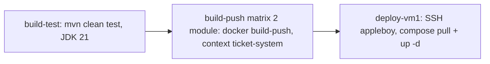

# Production & CI/CD

Index: [README.md](README.md) · Nguồn: `DEPLOYMENT.md` (root), `Infrastructure/docker-compose.prod.override.yml`,
`ticket-system/.github/workflows/ci-cd.yml`

## Mô hình triển khai

| Thành phần | Nơi chạy |
|---|---|
| Backend + toàn bộ hạ tầng | VM1 Oracle Always Free (Ampere A1, ~6GB RAM), tất cả bằng Docker, chế độ container + `tls/` |
| K8s sandbox | VM2 k3s riêng — xem [k8s-sandbox.md](k8s-sandbox.md) |
| Frontend | Vercel Git integration; chỉ set `VITE_KONG_API_URL=https://<domain>/api` |
| Image | GHCR `ghcr.io/<owner>/ticket-system-<module>:latest` |
| MySQL | container trên VM1 (không managed DB) |
| MinIO | **chưa có** compose — cần xác nhận trước khi deploy |

## Ngân sách RAM (`docker-compose.prod.override.yml`)

| Service (tên service compose) | `mem_limit` | Heap |
|---|---|---|
| `broker1..3` | 700m ×3 | `KAFKA_HEAP_OPTS=-Xmx400m -Xms400m` |
| `mysql` | 700m | mặc định |
| `kong` | 256m | — |
| `redis-node-1..6` | 150m ×6 | — |
| `booking-service`, `manage-revenue-ticket` | 500m ×2 | `JAVA_TOOL_OPTIONS=-Xmx350m` |
| `kafka-ui` | tắt (`profiles: ["debug"]`) | — |
| **Tổng trần** | ~4950m | còn ~1GB cho OS + nginx — sát, theo dõi `docker stats` |

Override gộp theo **tên service** (không phải `container_name`). Vượt `mem_limit` → container bị OOM-kill;
heap đặt thấp hơn để chừa metaspace/thread stack/page cache.

## CI/CD (`ticket-system/.github/workflows/ci-cd.yml`)

Trigger: push `main` khi đổi `booking_ticket/**`, `manage-revenue-ticket/**`, `common-library/**`, `pom.xml`.



Secret GitHub: `VM1_HOST`, `VM1_USER`, `VM1_SSH_KEY` (+ `GITHUB_TOKEN` cho GHCR).
Không trigger `pull_request`, không kiểm compose/Kong, không buildx cache (B27b, B27c). Đổi `Infrastructure/**`
không kích hoạt CI.

## ⚠ Lỗi đã xác nhận (2026-09-28, `docker compose config` v2.29.7, chưa sửa)

**1. Ghép override theo từng nhóm không chạy được** (cách README `Infrastructure/` hướng dẫn):

```bash
docker compose -f kafka/docker-compose.yml -f docker-compose.prod.override.yml config
# → service "redis-node-5" has neither an image nor a build context specified
docker compose -f app/docker-compose.yml -f docker-compose.prod.override.yml config
# → service "broker2" has neither an image nor a build context specified
```

Override khai báo mọi service; service nào không có trong file gốc thành service mới thiếu image → lỗi.
Bước `pull` trong job `deploy-vm1` dùng đúng tổ hợp `app + override` → **job deploy fail ở bước này**.

**2. Ghép tất cả file trong 1 lệnh (job `deploy-vm1`, `DEPLOYMENT.md` mục 1) chạy được nhưng sai:**

Compose resolve mọi đường dẫn tương đối theo thư mục của file `-f` **đầu tiên** (`mysql/`) và đặt project
name = `mysql`. Kết quả `config`:

| Khai báo | Resolve thành | Hậu quả |
|---|---|---|
| `./kong.yml` (kong) | `Infrastructure/mysql/kong.yml` | file không tồn tại → Docker tạo thư mục rỗng, Kong không có config |
| `./nginx.conf` (tls) | `Infrastructure/mysql/nginx.conf` | như trên, NGINX sai |
| `./data/node-N` (redis) | `Infrastructure/mysql/data/node-N` | thư mục mới rỗng → mất `nodes.conf`, cluster phải tạo lại |
| volume `broker1-data` | `mysql_broker1-data` (thay vì `kafka_broker1-data`) | Kafka lên với volume trống, mất topic/offset |
| mạng `kafka-net`, `redis-cluster-net` | thành `external: true` (gộp với khai báo trong `app/`) | VM mới chưa có 2 mạng này → `up` lỗi |
| `container_name` cố định | trùng container đã tạo bởi project `kafka`/`kong`… | `container name already in use` |

Build context `../../` và `env_file ../../.env` tình cờ vẫn đúng (cùng độ sâu).

**Hướng sửa (chưa làm, cần quyết định):** tách override thành file prod riêng cạnh từng compose
(`kafka/docker-compose.prod.yml`, `app/docker-compose.prod.yml`, …) và chạy từng nhóm trong thư mục của nó;
hoặc 1 file gốc dùng `include:` (Compose ≥ 2.20, mỗi file giữ thư mục riêng). Sau khi sửa, thêm
`docker compose … config --quiet` vào CI (B27b).

## Lệch khác trong `DEPLOYMENT.md`

- Bảo chạy `setup-cluster.sh` để tạo Redis cluster — script chỉ `rm -rf ./redis-data` (B29c); dùng lệnh
  `redis-cli --cluster create` trong [redis-cluster.md](redis-cluster.md).
- Kiểm tra `curl https://<domain>/api/booking/actuator/health` và `/api/actuator/health`: Kong `strip_path: false`
  nên BE nhận nguyên `/api/.../actuator/health`, không phải path actuator (`/actuator/health`) → không kiểm được
  health qua Kong. Kiểm health bằng Admin API `127.0.0.1:8001/upstreams/<name>/health` trên VM.

## Checklist triển khai (sau khi sửa lỗi override)

1. `docker network create ticket-system-network`
2. mysql → kafka → redis-cluster (+ `--cluster create` lần đầu) → kong (mặc định, `kong.yml`) → app → tls (từng thư mục)
3. `ticket-system/.env` có đủ biến, `chmod 600`
4. Kiểm: upstream HEALTHY, `curl -I https://<domain>/api/auth/me` → 401, `docker stats` dưới trần RAM
5. Firewall VM: chỉ mở 80/443 (+22). Không mở 3306, 8001, 9092-9094, 9000, 7001-7006, 17001-17006.
