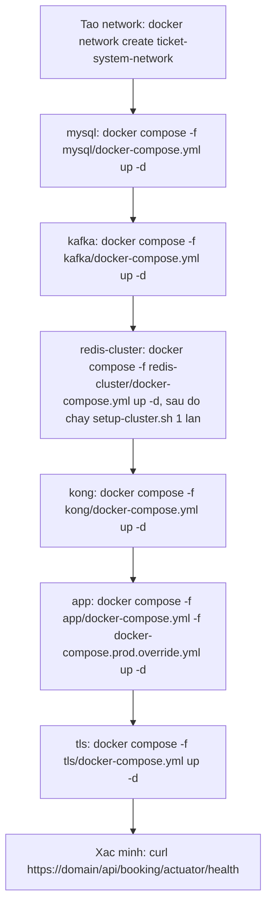

# Deployment Instructions — System_bus

Runbook thực thi cho việc deploy `ticket-system` (backend) + `booking_ticket_vue` (frontend).
File này thay thế các giả định chung chung đã đưa ra trước khi đọc được cấu trúc repo thật —
xem mục "Điều đã sửa lại" bên dưới.

## Điều đã sửa lại so với bản nháp ban đầu

| Giả định cũ | Thực tế trong repo | Sửa lại |
|---|---|---|
| DB Postgres (Neon/Supabase) | MySQL 8.0 (`Infrastructure/mysql`), db `quan-ly-ban-hang` | Giữ MySQL, chạy container ngay trên VM production như local dev — không tách ra managed DB ngoài, vì Kafka + Redis đã là state nằm trên VM rồi, tách riêng DB không giảm rủi ro đáng kể mà thêm 1 tài khoản ngoài phải quản |
| Thêm NGINX làm reverse proxy chính | Đã có **Kong 3.9** (`Infrastructure/kong`) làm API Gateway: route `/api/booking` → booking, `/api` → revenue, đã có rate-limiting, health check, correlation-id | Giữ Kong làm lớp routing chính. NGINX chỉ còn vai trò TLS termination mỏng, forward nguyên vào Kong — không route/rate-limit trùng |
| Kafka `apache/kafka:latest` generic | `confluentinc/cp-kafka:7.5.0`, KRaft combined mode, đã có `CLUSTER_ID` cố định, đã có `kafka-ui` | Giữ nguyên compose hiện có, chỉ thêm giới hạn heap cho production |
| Chưa biết Redis | Redis cluster 6 node thật (`Infrastructure/redis-cluster`), network riêng `redis-cluster-net` tách khỏi `ticket-system-network` | App service phải join **cả 2** network |
| — | `MINIO_*` được đọc trong code (theo `CLAUDE.md`) nhưng **không có compose file nào cho MinIO** trong `Infrastructure/` | Chưa rõ MinIO hiện chạy ở đâu (cài tay ngoài Docker?) — cần xác nhận trước khi deploy, chưa đưa vào compose ở đây |

## 0. Chuẩn bị

| Cần | Ghi chú |
|---|---|
| 2 VM Oracle Always Free (Ampere A1) | VM1 = production (toàn bộ `Infrastructure/`), VM2 = k3s sandbox học K8s |
| Domain | Cho TLS ở `Infrastructure/tls`. Chưa có → bỏ qua bước lấy cert, chạy tạm HTTP qua Kong port 8000 |
| GHCR | Bật sẵn theo GitHub repo, không cần setup thêm |
| SSH deploy key riêng | `ssh-keygen -t ed25519 -f deploy_key -N ""`, public key add vào VM1 `~/.ssh/authorized_keys` |
| **Xác nhận MinIO** | Trước khi deploy thật: MinIO hiện chạy local thế nào? Cần thêm 1 compose file `Infrastructure/minio/docker-compose.yml` nếu chưa có |

## 1. Thứ tự triển khai trên VM1



Lệnh gộp (chạy tại `ticket-system/Infrastructure/`, sau khi mạng đã tạo và MySQL/Kafka/Redis đã lên lần đầu):

```bash
docker network create ticket-system-network   # chỉ chạy 1 lần

docker compose \
  -f mysql/docker-compose.yml \
  -f kafka/docker-compose.yml \
  -f redis-cluster/docker-compose.yml \
  -f kong/docker-compose.yml \
  -f app/docker-compose.yml \
  -f tls/docker-compose.yml \
  -f docker-compose.prod.override.yml \
  up -d
```

Redis cluster cần khởi tạo 1 lần duy nhất (theo đúng lệnh đã có trong `CLAUDE.md`):

```bash
docker exec -it redis-1 redis-cli --cluster create \
  172.30.0.11:7001 172.30.0.12:7002 172.30.0.13:7003 \
  172.30.0.14:7004 172.30.0.15:7005 172.30.0.16:7006 \
  --cluster-replicas 1
```

## 2. Ngân sách RAM trên VM 6GB (Oracle Ampere A1)

Xem chi tiết/comment trong `Infrastructure/docker-compose.prod.override.yml`. Tổng giới hạn cứng đặt ra ~4.95GB, còn lại cho OS + TLS proxy khá sát — theo dõi bằng `docker stats` sau khi lên đủ, không chắc VM free hiện tại cấp chính xác bao nhiêu OCPU/RAM, cần kiểm tra thực tế lúc tạo VM.

Đã tắt `kafka-ui` mặc định trên production (dùng `--profile debug` khi cần debug thủ công) để tiết kiệm RAM.

## 3. CI/CD

Workflow: `ticket-system/.github/workflows/ci-cd.yml` — build/test Maven → build & push 2 image (`ticket-system-booking_ticket`, `ticket-system-manage-revenue-ticket`) lên GHCR → SSH vào VM1 pull + up lại app layer.

Secrets cần tạo trong GitHub repo `ticket-system`: `VM1_HOST`, `VM1_USER`, `VM1_SSH_KEY`.

Frontend (`booking_ticket_vue`): dùng Vercel Git integration trực tiếp (connect repo trong Vercel dashboard), không cần workflow riêng — Vercel tự build/deploy khi push, đơn giản hơn tự viết pipeline. Set duy nhất `VITE_KONG_API_URL` trỏ về domain Kong/TLS proxy production (`https://your-domain.com/api`) trong Vercel Environment Variables. FE chỉ có một client, Kong tự định tuyến `/api/booking` tới Booking Service và `/api/*` tới Manage Revenue Service.

## 4. VM2 — K8s sandbox

```bash
curl -sfL https://get.k3s.io | sh -
kubectl apply -f https://raw.githubusercontent.com/kubernetes/ingress-nginx/controller-v1.11.0/deploy/static/provider/baremetal/deploy.yaml
kubectl apply -f ticket-system/Infrastructure/k8s-sandbox/booking-deployment.yaml
```

Chỉ deploy `booking-replica` độc lập, không nối Kafka/MySQL/Redis production — tránh tạo consumer group đọc trùng dữ liệu thật.

## 5. Xác minh sau triển khai

| Kiểm tra | Lệnh |
|---|---|
| Booking service qua Kong | `curl https://your-domain.com/api/booking/actuator/health` |
| Revenue service qua Kong | `curl https://your-domain.com/api/actuator/health` |
| Kafka đủ 3 broker | `docker exec broker1 kafka-broker-api-versions --bootstrap-server localhost:9092` |
| Redis cluster khoẻ | `docker exec redis-1 redis-cli -p 7001 cluster info` |
| k3s sandbox | `kubectl get pods -A` trên VM2 |
